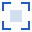

<div align="center">
  

  <h1>Image Rect Picker</h1>

  <p><strong>Precise image regions. Coordinates in your format.</strong></p>
  
  <p>Your images stay in your browser. Nothing is uploaded or saved.</p>
</div>

<hr>

Select a rectangular region in an image and copy its coordinates in your preferred format. Useful for sprite regions, image-processing commands, and other tasks that need precise pixel coordinates.

## Features

- Open an image or drag and drop it into the workspace.
- Draw, move, and resize a selection with a mouse, touch, or pen.
- Enter coordinates directly, or use arrow keys for 1-pixel adjustments and `Shift` + `arrow` keys for 10 pixels.
- Zoom around the cursor, fit the whole image, or view it at 100%. Coordinates always refer to the original image.
- Pan with `Space` + drag, the middle mouse button, or the Pan mode button. Resize handles stay centered on each visible edge.
- Toggle light and dark with the top-right button, or choose System, Light, or Dark from the menu.
- Customize the output template and copy the result.
- Replace or clear the image while keeping your template. Reloading the page resets everything.

## Output format

The default template is:

```text
{width}x{height}+{x}+{y}
```

For example, a 30 × 40 selection starting at (10, 20) produces `30x40+10+20`.

| Placeholder | Value |
| --- | --- |
| `{x}`, `{y}` | Top-left coordinates |
| `{width}`, `{height}` | Selection size |
| `{x2}`, `{y2}` | Exclusive right and bottom edges: x + width, y + height |

Coordinates are whole pixels measured from the image's top-left corner. You can use any combination of placeholders, such as `{x}, {y}, {width}, {height}`.

## Supported images

PNG, JPEG, WebP, GIF, and BMP, up to **20 MiB** and **50 megapixels**. One image and one selection at a time. SVG is not supported.
